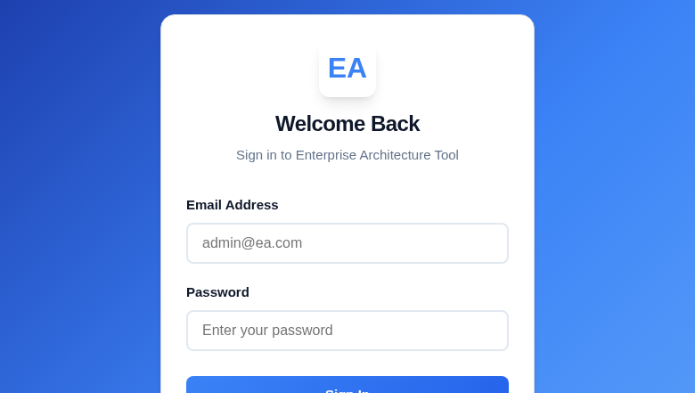
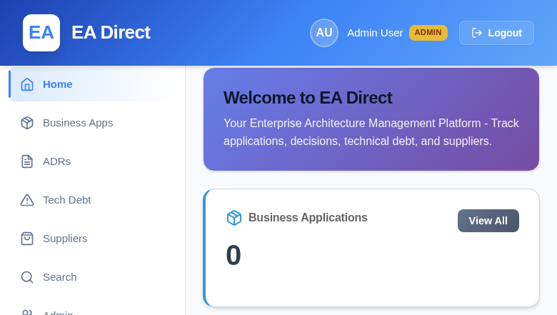
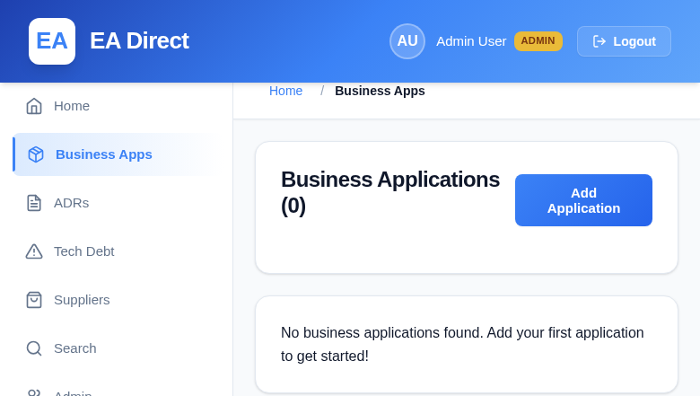
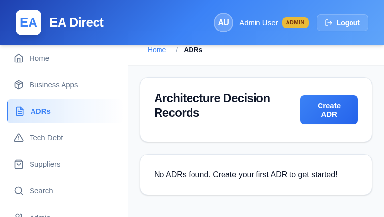
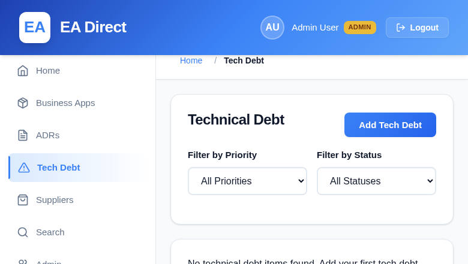
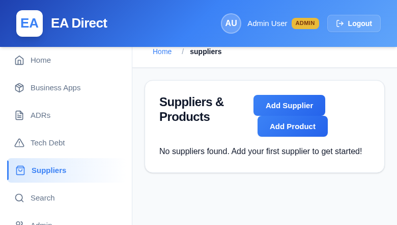
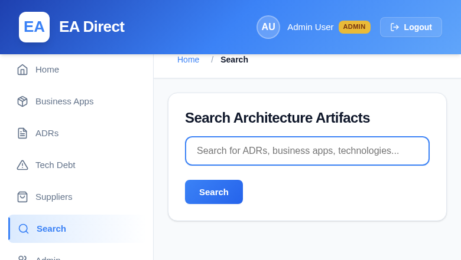
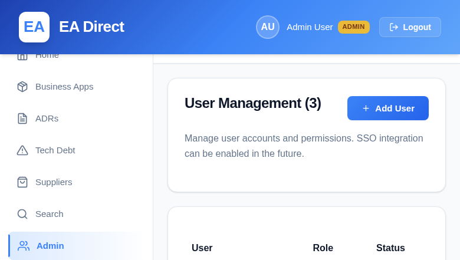

# EA Direct - Enterprise Architecture Management Platform

A comprehensive enterprise architecture management system for tracking business applications, architecture decisions, technical debt, and suppliers.

## Features

- **Business Application Management**: Track your application portfolio with supplier and product integration
- **Architecture Decision Records (ADRs)**: Document decisions with multiple options and trade-off analysis
- **Technical Debt Tracking**: Manage and prioritize technical debt with automatic creation from tactical decisions
- **Supplier & Product Management**: Maintain supplier relationships and product catalogs
- **User Management**: Role-based access control with admin and user roles
- **Dashboard**: Real-time statistics and recent activity across all data types
- **Full-Text Search**: Find artifacts quickly across the entire system
- **RESTful API**: Complete OpenAPI documentation
- **Audit Trails**: Full change history for all entities

## Screenshots

### Login Page

*Secure authentication with email/password. SSO integration ready for future implementation.*

### Dashboard

*Overview of all enterprise architecture artifacts with quick statistics and actions.*

### Business Applications

*Comprehensive application portfolio management with lifecycle tracking.*

### Architecture Decision Records (ADRs)

*Document architectural decisions with multiple options and trade-off analysis.*

### Technical Debt Tracking

*Track and prioritize technical debt with filtering by priority and status.*

### Supplier & Product Management

*Manage supplier relationships and product catalogs in one place.*

### Search Functionality

*Full-text search across all architecture artifacts for quick discovery.*

### User Management (Admin)

*Role-based access control with admin and user roles.*

## Quick Start with Docker (Recommended)

The fastest way to get EA Direct running is with Docker:

### Prerequisites

- Docker (version 20.10 or higher)
- Docker Compose (version 2.0 or higher)

### Deploy in 2 Steps

1. **Clone the repository:**
```bash
git clone https://github.com/jockking/EADirect.git
cd EADirect
```

2. **Start the application:**
```bash
docker compose up -d
```

That's it! The database will be automatically initialized on first startup.

### Access the Application

- **Frontend**: http://localhost
- **Backend API**: http://localhost:8000
- **API Documentation**: http://localhost:8000/docs

### Default Login Credentials

- **Admin**: admin@ea.com / admin
- **User**: user@ea.com / user

### Docker Management Commands

```bash
# View logs
docker compose logs -f

# Stop the application
docker compose down

# Rebuild after code changes
docker compose up -d --build

# Check service health
docker compose ps

# Access backend shell
docker compose exec backend sh

# Database backup
docker compose exec postgres pg_dump -U postgres enterprise_architecture > backup.sql
```

For detailed Docker deployment information, see [DOCKER.md](DOCKER.md).

## Architecture

### Technology Stack

**Backend:**
- Python 3.11 with FastAPI
- PostgreSQL 15 database
- SQLAlchemy ORM
- Pydantic for validation
- JWT authentication
- Bcrypt password hashing

**Frontend:**
- React with Vite
- React Router for navigation
- Axios for API communication
- Modern, responsive UI

**Deployment:**
- Docker containers
- Nginx reverse proxy
- Docker Compose orchestration

### System Architecture

```
┌─────────────┐
│   Browser   │
└──────┬──────┘
       │ http://localhost
       │
┌──────▼──────────────┐
│  Frontend (Nginx)   │  Port 80
│  - React SPA        │
│  - Reverse Proxy    │
└──────┬──────────────┘
       │ /api/* → backend:8000
       │
┌──────▼──────────────┐
│  Backend (FastAPI)  │  Port 8000
│  - REST API         │
│  - Business Logic   │
└──────┬──────────────┘
       │
┌──────▼──────────────┐
│  PostgreSQL DB      │  Port 5432
│  - Persistent Data  │
└─────────────────────┘
```

## Manual Setup (Without Docker)

### Prerequisites

- Python 3.11+
- Node.js 18+
- PostgreSQL 15+
- npm or yarn

### Backend Setup

1. **Create PostgreSQL database:**
```bash
createdb enterprise_architecture
```

2. **Navigate to backend directory:**
```bash
cd backend
```

3. **Create virtual environment:**
```bash
python -m venv venv
source venv/bin/activate  # On Windows: venv\Scripts\activate
```

4. **Install dependencies:**
```bash
pip install -r requirements.txt
```

5. **Configure database:**
Create `backend/database.config.json`:
```json
{
  "database": {
    "host": "localhost",
    "port": 5432,
    "database": "enterprise_architecture",
    "user": "postgres",
    "password": "your_password"
  }
}
```

Or use environment variables:
```bash
export DATABASE_HOST=localhost
export DATABASE_PORT=5432
export DATABASE_NAME=enterprise_architecture
export DATABASE_USER=postgres
export DATABASE_PASSWORD=your_password
```

6. **Initialize database:**
```bash
python init_db.py
```

7. **Run backend server:**
```bash
python main.py
```

The API will be available at `http://localhost:8000`

### Frontend Setup

1. **Navigate to frontend directory:**
```bash
cd frontend
```

2. **Install dependencies:**
```bash
npm install
```

3. **Run development server:**
```bash
npm run dev
```

The frontend will be available at `http://localhost:5173`

## Usage Guide

### Dashboard

The home page displays:
- Total counts for all entity types
- Status breakdowns for apps, ADRs, and tech debt
- Priority distribution for technical debt
- Recent activity across all categories
- Quick action buttons
- **Generate Sample Data button** - Quickly populate the database with realistic demo data

### Sample Data Generation

To demonstrate the platform's capabilities, you can generate comprehensive sample data:

**Via UI (Recommended):**
1. Navigate to the Dashboard (home page)
2. Click the "Generate Sample Data" button in the Quick Actions section
3. Confirm the action (this will clear existing data)
4. Wait for the success message

**Via Command Line:**
```bash
# Docker environment
docker compose exec backend python generate_sample_data.py

# Local environment
cd backend
python generate_sample_data.py
```

**Sample Data Includes:**
- 5 Suppliers (Microsoft, AWS, Red Hat, Oracle, Atlassian)
- 12 Products across all suppliers
- 6 Business Applications with various statuses and owners
- 5 Architecture Decision Records (ADRs) with multiple decision options
- 6 Technical Debt items with different priorities and links to ADRs

This is perfect for:
- Exploring the platform features
- Testing integrations
- Demonstrating to stakeholders
- Training new users

### Business Applications

Manage your application portfolio:
- Track application details, owners, and status
- Link to supplier products
- Monitor lifecycle status (active, deprecated, planned, retired)
- Record hosting type, development type, and resilience category

### Architecture Decision Records (ADRs)

Document architectural decisions with:
- Multiple decision options with pros/cons analysis
- Cost and effort estimates per option
- Recommended, strategic, and interim selections
- Stakeholder tracking
- Related ADR linking
- Automatic technical debt creation from tactical decisions

### Technical Debt

Track and manage technical debt:
- Priority levels: low, medium, high, critical
- Status tracking: identified, accepted, in-progress, resolved, won't-fix
- Link to originating ADRs
- Target and actual resolution dates
- Impact assessment
- Affected systems tracking

### Suppliers & Products

Maintain supplier and product information:
- Supplier contact details and websites
- Product catalogs with versions and licenses
- Link products to business applications
- Track support URLs and documentation

### Search

Full-text search across:
- Business applications
- ADRs
- Technical debt
- Suppliers
- Products

### User Management (Admin Only)

- Create and manage user accounts
- Assign roles (admin/user)
- Set user status
- Track login activity

## API Endpoints

### Authentication
- `POST /auth/login` - User login
- `POST /auth/logout` - User logout

### Dashboard
- `GET /dashboard` - Dashboard statistics

### Business Applications
- `GET /business-apps` - List all applications
- `GET /business-apps/{id}` - Get specific application
- `POST /business-apps` - Create application
- `PUT /business-apps/{id}` - Update application
- `DELETE /business-apps/{id}` - Delete application
- `GET /business-apps/{id}/history` - Get change history

### ADRs
- `GET /adrs` - List all ADRs
- `GET /adrs/{id}` - Get specific ADR
- `POST /adrs` - Create ADR
- `PUT /adrs/{id}` - Update ADR
- `DELETE /adrs/{id}` - Delete ADR
- `GET /adrs/{id}/history` - Get change history
- `GET /adrs/{id}/tech-debt` - Get linked technical debt

### Technical Debt
- `GET /tech-debt` - List all tech debt
- `GET /tech-debt/{id}` - Get specific debt item
- `POST /tech-debt` - Create debt item
- `PUT /tech-debt/{id}` - Update debt item
- `DELETE /tech-debt/{id}` - Delete debt item
- `GET /tech-debt/{id}/history` - Get change history

### Suppliers
- `GET /suppliers` - List all suppliers
- `GET /suppliers/{id}` - Get specific supplier
- `POST /suppliers` - Create supplier
- `PUT /suppliers/{id}` - Update supplier
- `DELETE /suppliers/{id}` - Delete supplier

### Products
- `GET /products` - List all products
- `GET /products/{id}` - Get specific product
- `GET /suppliers/{id}/products` - List products by supplier
- `POST /products` - Create product
- `PUT /products/{id}` - Update product
- `DELETE /products/{id}` - Delete product

### Users (Admin Only)
- `GET /users` - List all users
- `GET /users/{id}` - Get specific user
- `POST /users` - Create user
- `PUT /users/{id}` - Update user
- `DELETE /users/{id}` - Delete user

### Search
- `GET /search?q={query}&type={type}` - Search all artifacts

Full API documentation available at: http://localhost:8000/docs

## Development

### Backend Development

```bash
# Activate virtual environment
source venv/bin/activate

# Run backend
python main.py

# Run with auto-reload (for development)
uvicorn main:app --reload --host 0.0.0.0 --port 8000

# Database operations
python init_db.py  # Initialize/reset database
```

### Frontend Development

```bash
# Development server with hot reload
npm run dev

# Build for production
npm run build

# Preview production build
npm run preview

# Linting
npm run lint
npm run lint:fix
```

### Docker Development

```bash
# Rebuild specific service
docker compose up -d --build backend

# View logs for specific service
docker compose logs -f backend

# Execute commands in container
docker compose exec backend python -c "print('Hello')"

# Hot reload (add volume mount in docker-compose.override.yml)
docker compose up -d
```

## Database Management

### Backup

```bash
# Docker environment
docker compose exec postgres pg_dump -U postgres enterprise_architecture > backup.sql

# Local PostgreSQL
pg_dump -U postgres enterprise_architecture > backup.sql
```

### Restore

```bash
# Docker environment
cat backup.sql | docker compose exec -T postgres psql -U postgres enterprise_architecture

# Local PostgreSQL
psql -U postgres enterprise_architecture < backup.sql
```

### Reset Database

```bash
# Stop application
docker compose down

# Remove volume
docker volume rm eadirect_postgres_data

# Restart and reinitialize
docker compose up -d
docker compose exec backend python init_db.py
```

## Configuration

### Environment Variables

The application supports configuration via environment variables:

**Database:**
- `DATABASE_HOST` - Database host (default: localhost)
- `DATABASE_PORT` - Database port (default: 5432)
- `DATABASE_NAME` - Database name (default: enterprise_architecture)
- `DATABASE_USER` - Database user (default: postgres)
- `DATABASE_PASSWORD` - Database password

**Security:**
- `SECRET_KEY` - JWT secret key (change in production!)
- `ALLOWED_ORIGINS` - CORS origins (comma-separated)

**Application:**
- `BACKEND_PORT` - Backend port (default: 8000)

### Docker Configuration

Edit `.env.docker` or update `docker-compose.yml` to customize:
- Port mappings
- Resource limits
- Volume mounts
- Network configuration

See [DOCKER.md](DOCKER.md) for detailed configuration options.

## Troubleshooting

### Docker Issues

**Containers won't start:**
```bash
docker compose logs
docker compose ps
```

**Database connection errors:**
```bash
docker compose exec postgres pg_isready -U postgres
docker compose exec backend python -c "from database import engine; print(engine)"
```

**Port conflicts:**
```bash
# Check what's using the ports
lsof -i :80
lsof -i :8000
lsof -i :5432
```

**Reset everything:**
```bash
docker compose down -v
docker compose up -d
docker compose exec backend python init_db.py
```

### Application Issues

**Frontend can't reach backend:**
- Check nginx configuration in `frontend/nginx.conf`
- Verify backend is healthy: `docker compose ps`
- Check backend logs: `docker compose logs backend`

**Login fails:**
- Verify database is initialized: `docker compose exec backend python init_db.py`
- Check user exists in database
- Verify password hashing is working

**Empty dashboard:**
- Login successfully first
- Check browser console for errors
- Verify API endpoints are accessible: http://localhost:8000/docs

## Security Notes

⚠️ **Production Deployment:**

1. **Change default passwords** - Update all default credentials
2. **Update SECRET_KEY** - Use a strong, random secret key
3. **Enable HTTPS** - Use SSL/TLS certificates
4. **Review CORS settings** - Limit allowed origins
5. **Use secrets management** - Don't commit sensitive data
6. **Regular updates** - Keep dependencies current
7. **Database backups** - Implement backup strategy
8. **Monitoring** - Set up logging and monitoring

## Contributing

Contributions are welcome! Please:
1. Fork the repository
2. Create a feature branch
3. Make your changes
4. Submit a pull request

## Documentation

- [Docker Deployment Guide](DOCKER.md) - Comprehensive Docker documentation
- [Architecture Guide](CLAUDE.md) - Technical architecture and development guide
- [Feature Enhancements](ENHANCEMENTS.md) - Detailed feature documentation

## Repository

GitHub: https://github.com/jockking/EADirect

## License

This project is for educational and enterprise architecture management purposes.

## Support

For issues or questions:
- GitHub Issues: https://github.com/jockking/EADirect/issues
- Check logs: `docker compose logs -f`
- Review documentation in DOCKER.md and ENHANCEMENTS.md
